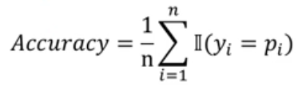
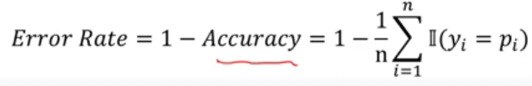
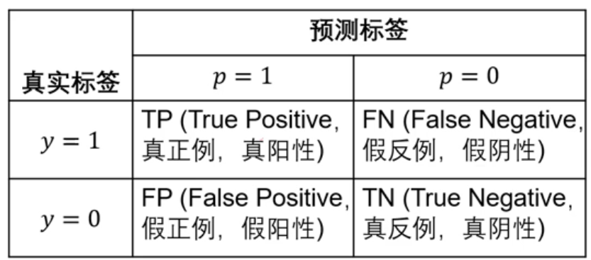
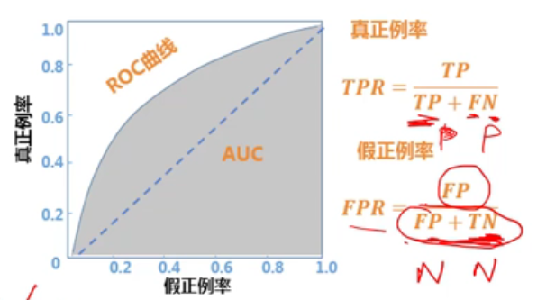

# 机器学习

机器学习实验方法与原则

## 评价指标 :star2:

### 回归任务

预测值$p_i$为连续值，需要衡量与真实值$y_i$之间的误差

#### 平均绝对误差 $MAE$

公式：

$$MAE=\frac{1}{n}\sum_{i=1}^{n}|y_i-p_i|$$

#### 均方误差 $MSE$

$$MSE=\frac{1}{n}\sum_{i=1}^n(y_i-p_i)^2$$

平方之后，会使得误差更大或者更小

#### 均方根误差 $RMSE$

$$RMSE =\sqrt{MSE}= \sqrt{\frac{1}{n}\sum_{i=1}^{n}(y_i-p_i)^2}$$

rating prediction 中常会用到后两种评价指标

### 分类任务

预测值一般为离散值，需要判断是否等于真实类别

#### 准确率 Accuracy

#### 误差率 Error Rate

### 二分类任务

#### 精准率/精度 Precision

预测为正例的样本中有多少确为正例

$$Precision = \frac{TP}{TP+FP}$$ 

#### 召回率 Recall

找到的真实正例占所有正例中的比例

#### $F_\beta$ 

$F_\beta$表示的Precision与Recall的加权调和平均

#### $AUC$ 

Area Under ROC Curve 考虑二分类时划分正负的阈值，相当稳定的指标，用来评价正例排在负例前面的概率

##### ROC曲线

 

### 特定任务

## 统计有效性检验 :star:

